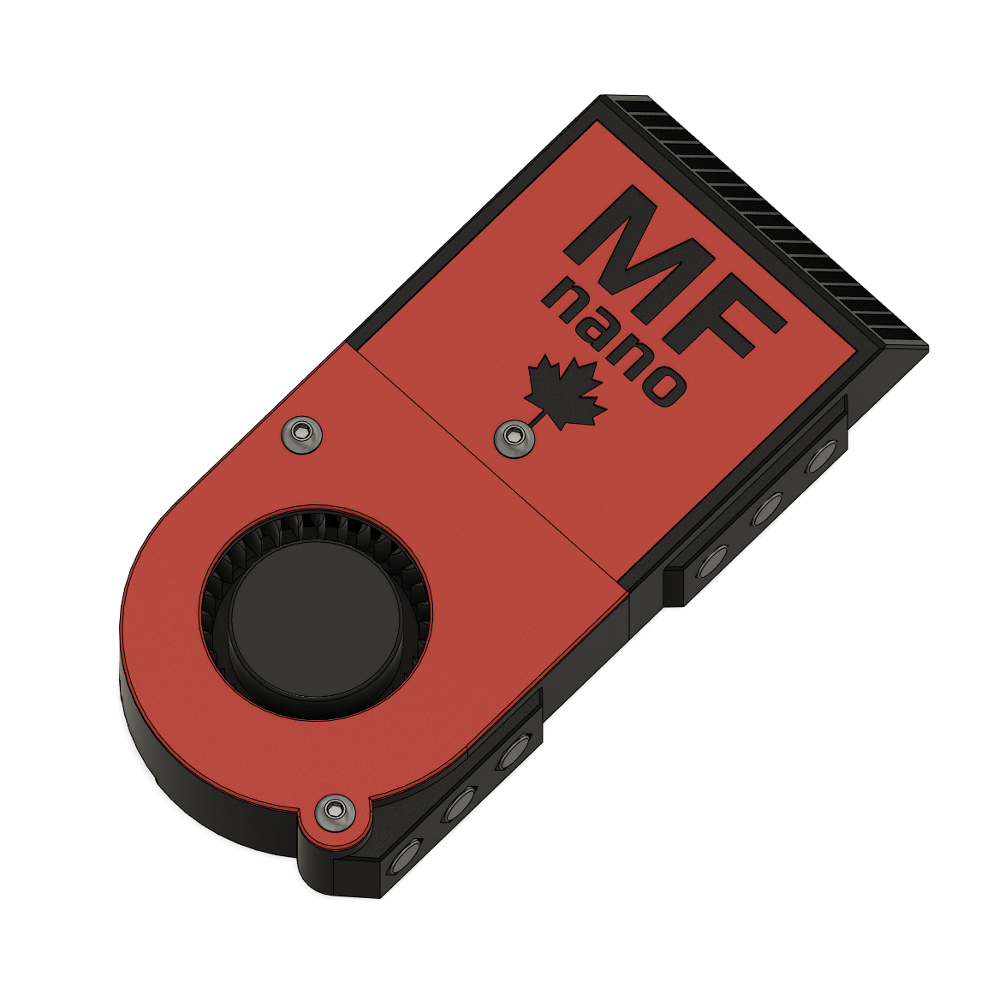

# MF Nano

A tiny recirculating carbon filter for the Voron V0 and other small 3D printers.  

MF Nano was Inspired by the [Nevermore Micro](https://github.com/nevermore3d/Nevermore_Micro/).  

If you have the space, use a nevermore.  If you don't, maybe the MF Nano is for you.

## BOM

- 2x M3x16 BHCS
- 5x M3x6 BHCS
- 8x 4x6mm Neodymium Magnets
- 8-12x 6x3mm Neodymium Magnets
- 3x M3 Heatset Insert
- 5015 Blower Fan

## Printing Tips

 - Use a 0.2mm layer height on the cartridge body or the grill might not print correctly.
 

## Assembly

https://user-images.githubusercontent.com/105010153/224429391-bcc5b0e7-bd89-4d3e-93c5-b1fe3c05a4ea.mp4

